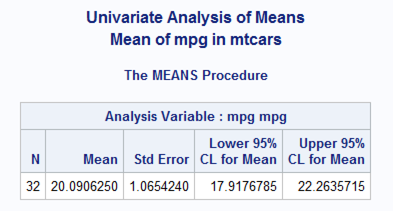
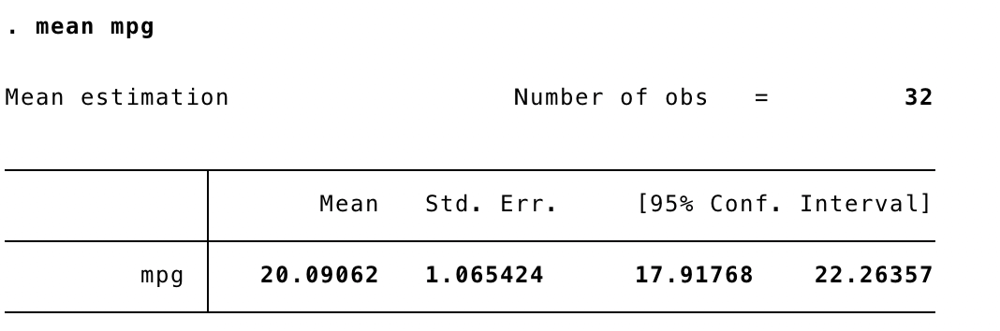
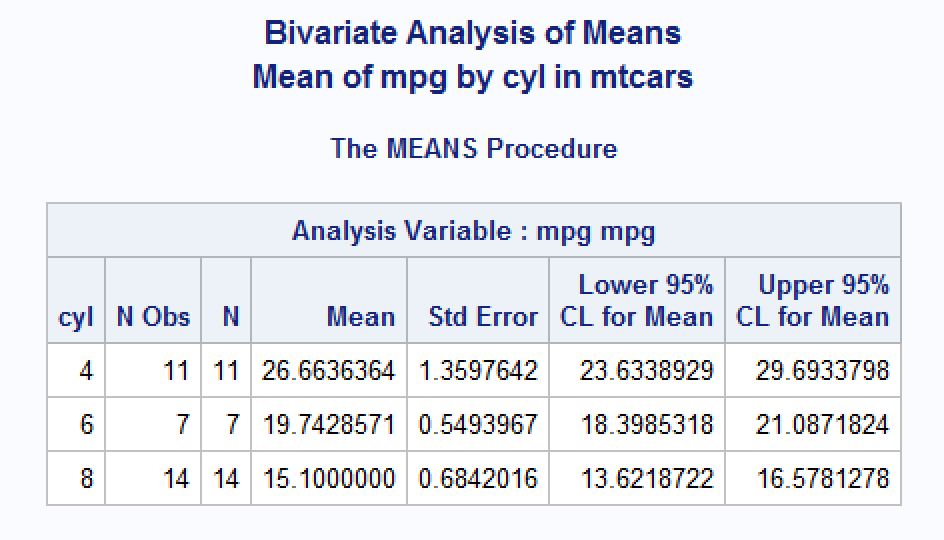
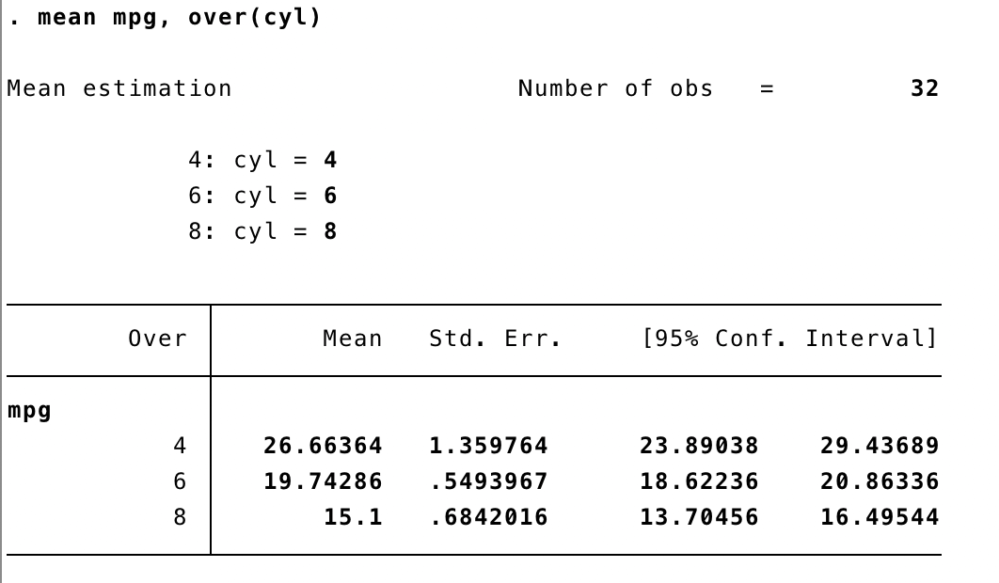

```{r, include = FALSE}
knitr::opts_chunk$set(
  collapse = TRUE,
  comment = "#>"
)
```

```{r setup}
library(dplyr)
library(meantables)
```

<style>
  hr 
  {
    background-color: #66b3ff;
    height: 1px;
  }
  blockquote
  {
    font-size: 12pt;
    font-style: italic;
    border-left: 4px solid #66b3ff;
  }
</style>

Table of contents:

[About data](#about-data)

[Univariate means and 95% confidence intervals](#univariate-means)

[Bivariate means and 95% confidence intervals](#bivariate-means)

# Univariate means and 95% confidence intervals {#univariate-means}

In this example, we will calculate the overall mean and 95% confidence interval for the variable mpg in the mtcars data set. 

By default, only the n, mean, and 95% confidence interval for the mean are returned. Additionally, the values of all the returned statistics are rounded to the hundredths place. These are the numerical summaries of the data that I am most frequently interested in. Additionally, I rarely need the precision of the estimates to be any greater than the hundredths place.

The confidence intervals are calculated as:

$$ {\bar{x} \pm t_{(1-\alpha / 2, n-1)}} \frac{s}{\sqrt{n}} $$

&nbsp;

This matches the method used by SAS: http://support.sas.com/documentation/cdl/en/proc/65145/HTML/default/viewer.htm#p0klmrp4k89pz0n1p72t0clpavyx.htm

```{r}
mtcars %>% 
  mean_table(mpg)
```

By adjusting the `t_prob` parameter, it is possible to change the width of the confidence intervals. The example below returns a 99% confidence interval.

The value for t_prob is calculated as 1 - alpha / 2.

```{r}
alpha <- 1 - .99
t <- 1 - alpha / 2

mtcars %>% 
  mean_table(mpg, t_prob = t)
```

With the `output = "all"` option, mean_table also returns the number of missing values, the critical value from student's t distribution with degrees of freedom n - 1, and the standard error of the mean.

We can also control the precision of the statistics using the `digits` parameter.

```{r}
mtcars %>% 
  mean_table(mpg, output = "all", digits = 5)
```

This output matches the results obtained from SAS proc means and the Stata mean command (shown below).

{width=600px}

&nbsp;

{width=600px}

Finally, the object returned by `mean_table` is given the class `mean_table` when the data frame passed to the `.data` argument is an ungrouped tibble.

[top](#top)

&nbsp;


-------------------------------------------------------------------------------

# Bivariate means and 95% confidence intervals {#bivariate-means}

The methods used to calculate bivariate means and confidence are identical to those used to calculate univariate means and confidence intervals. Additionally, all of the options shown above work identically for bivariate analysis. In order to estimate bivariate (subgroup) means and confidence intervals over levels of a categorical variable, the `.data` argument to `mean_table` should be a grouped tibble created with `dplyr::group_by`. Everything else should "just work."

The object returned by `mean_table` is given the class `mean_table_grouped` when the data frame passed to the `.data` argument is a grouped tibble (i.e., `grouped_df`). 

```{r}
mtcars %>% 
  group_by(cyl) %>% 
  mean_table(mpg, output = "all", digits = 5)
```

For comparison, here is the output from SAS proc means and the Stata mean command.

{width=600px}

{width=600px}

The method used by Stata to calculate subpopulation means and confidence intervals is available here: https://www.stata.com/manuals13/rmean.pdf

[top](#top)
